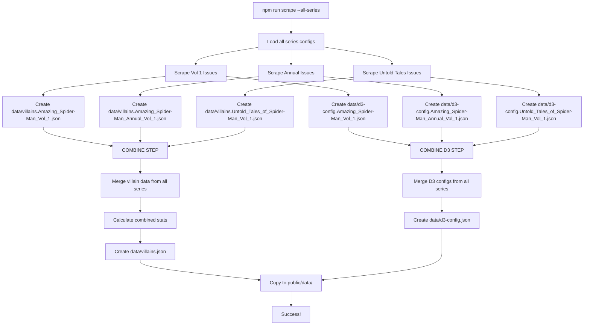
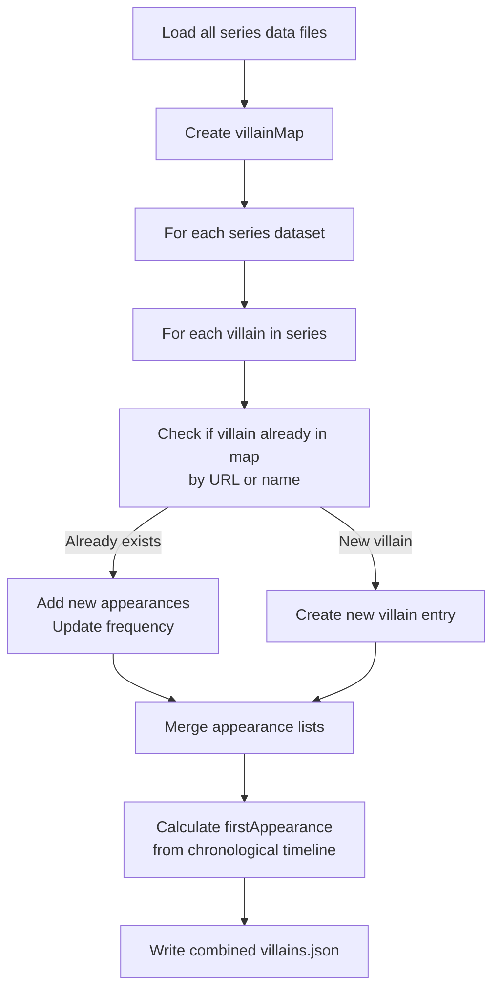
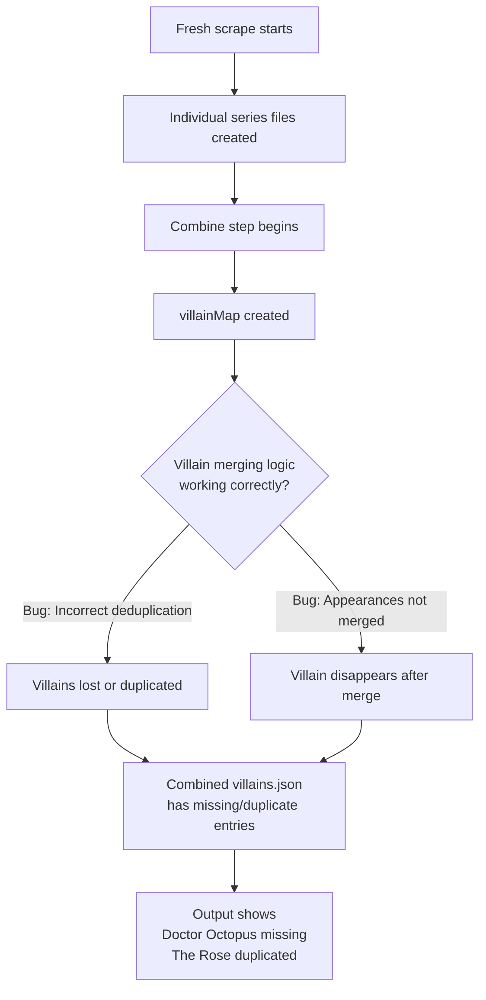

# Spider-Man Villain Timeline - Data Flow Diagram

## Scraping Process Flow

## Data Merge Logic (Current Implementation)

## Current Issue Flow

## Key Files in Data Flow

| File | Purpose | Created By |
|------|---------|-----------|
| `src/index.ts` | Main scraping orchestrator | Core logic |
| `src/scraper/marvelScraper.ts` | Individual series scraper | Series-specific scraping |
| `data/villains.*.json` | Single series villain data | marvelScraper + processVillainData |
| `data/d3-config.*.json` | Single series D3 config | D3ConfigBuilder.build() |
| `data/d3-config.json`   | Combined D3 config     | D3ConfigBuilder.buildAndSaveFromCombined() |
| `data/villains.json` | **Combined data from all series** | **Merge logic in src/index.ts** |
| `data/d3-config.json` | **Combined D3 config** | **Merge logic in src/index.ts** |
| `public/data/*` | Mirror of data files | Copy step |

## Suspected Issue Location

The problem likely occurs in `src/index.ts` where:
1. Individual series datasets are loaded
2. Villain data is merged using a map (villainMap, groupMap)
3. Combined data is written to files

**Critical sections to investigate:**
- Lines where villainMap is populated
- Deduplication logic using URL/name as key
- How appearances are merged from multiple series
- Timeline merging and firstAppearance calculation
