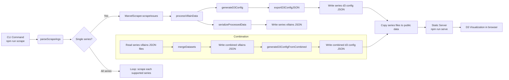
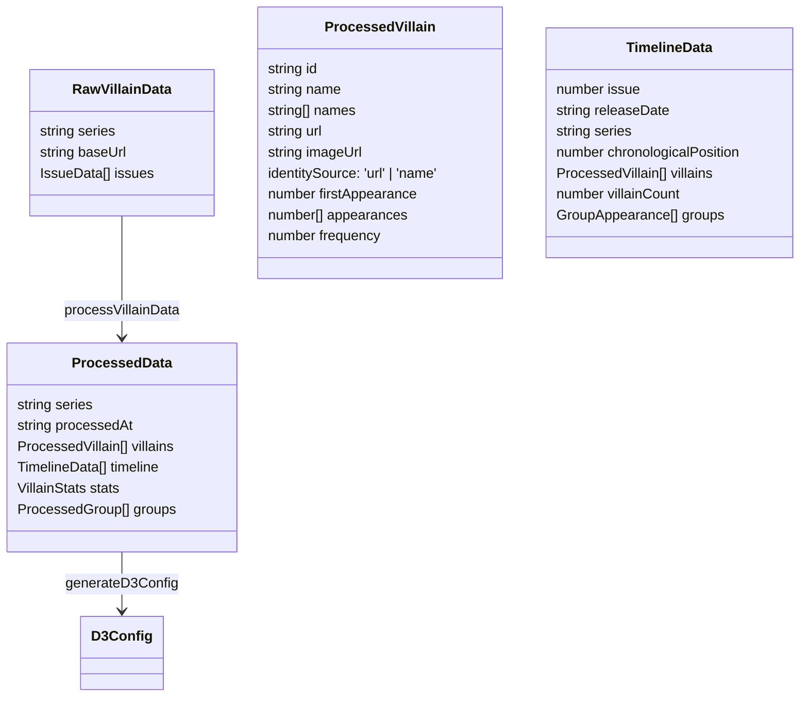

# Functional Documentation: Spider-Man Villain Timeline

This document describes the functional behavior of the system: how scraping, processing, merging, and visualization work together. It also highlights refactoring and redesign opportunities based on current implementation.

## System Overview

- **Goal:** Scrape Marvel Fandom issues for Spider‑Man series, normalize antagonist data, compute timeline statistics, and render interactive D3 visualizations.
- **Core Stages:** Scrape → Process → Serialize → Merge → Generate D3 Config → Publish → Visualize.
- **Primary Modules:**
  - [src/index.ts](src/index.ts) — CLI entry, orchestration, file IO, public export.
  - [src/scraper/marvelScraper.ts](src/scraper/marvelScraper.ts) — HTTP requests and HTML parsing (Axios + Cheerio).
  - [src/utils/dataProcessor.ts](src/utils/dataProcessor.ts) — Normalization, deduplication, stats, timeline.
  - [src/utils/mergeDatasets.ts](src/utils/mergeDatasets.ts) — Combine series datasets into a unified timeline.
  - [src/visualization/d3Graph.ts](src/visualization/d3Graph.ts) — D3 configuration generation.
  - [src/utils/generateD3FromCombined.ts](src/utils/generateD3FromCombined.ts) — D3 config generation from combined data.
  - [src/utils/cliParser.ts](src/utils/cliParser.ts) — CLI option parsing for volumes and issues.
  - [src/types.ts](src/types.ts) — Shared typed model.

## Functional Flow



## Module Responsibilities

- **CLI Orchestration:**
  - Reads args and decides single vs multi‑series runs. See [src/index.ts](src/index.ts).
  - Ensures data directories, writes JSON outputs, and copies assets to [public/data](public/data).

- **Scraper:**
  - Fetches issue pages and extracts antagonists lists and metadata (title, dates). See [src/scraper/marvelScraper.ts](src/scraper/marvelScraper.ts).
  - Expected behavior: rate‑limit to ~1 req/sec, cache, and validate data before emission.

- **Processor:**
  - Normalizes names, removes aliases, and standardizes spacing via `normalizeVillainName()`.
  - Uses canonical URL as identity when available via `getCanonicalUrl()`; falls back to normalized name.
  - Aggregates appearances, computes `firstAppearance`, `frequency`, and `names` variants.
  - Separates groups using `classifyKind()`; builds per‑issue `groups` with dynamic `members` from villains present.
  - Generates `timeline` with `chronologicalPosition` and per‑issue `villainCount`.
  - Computes `stats`: `totalVillains`, `mostFrequent`, `averageFrequency`, `firstAppearances` map.
  - Serializes into UI‑ready JSON via `serializeProcessedData()`. See [src/utils/dataProcessor.ts](src/utils/dataProcessor.ts).

- **Merger:**
  - Reads series‑specific `villains.*.json` and produces a `Combined` dataset. See [src/utils/mergeDatasets.ts](src/utils/mergeDatasets.ts).
  - Keeps cross‑series identity using villain `id`, `url`, and names.

- **Visualization Config:**
  - Translates processed or combined timeline into D3 `data`, `scales`, and `colors`. See [src/visualization/d3Graph.ts](src/visualization/d3Graph.ts) and [src/utils/generateD3FromCombined.ts](src/utils/generateD3FromCombined.ts).

- **Publishing:**
  - Copies both combined and series‑specific files to [public/data](public/data) for browser use. See `copyDataToPublic()` in [src/index.ts](src/index.ts).
  - Serves with Python simple server via `npm run serve` (or use a Node static server alternative).

## Key Data Contracts

- `RawVillainData` → scraped input per series.
- `ProcessedData` → normalized output (villains, timeline, groups, stats).
- `D3Config` → visualization config consumed by [public/script.js](public/script.js).
- Series outputs: [data](data) (e.g., `villains.Series.json`, `d3-config.Series.json`).
- Combined outputs: [data/villains.json](data/villains.json) and [data/d3-config.json](data/d3-config.json).



## Operational Notes

- **Build TypeScript and verify compiled output:**
  - Run `npm run build` and confirm changes propagate to [public/script.js](../public/script.js).
- **Identity policy:**
  - All `ProcessedVillain` records have `identitySource: 'url' | 'name'` to track identity basis. Entities identified by URL remain separate from those identified by name only, even if names match. No retroactive reconciliation.
- **Prefer fast validation over scraping:**
  - Use `npx ts-node test-merge-logic.ts` to validate merging logic quickly.
- **Scraping resumption:**
  - Always use series‑specific files in [data](../data) to check progress (not the merged defaults).
- **Image caching:**
  - Key filenames by character page URL slug (e.g., `the-rose-kingpin`), not display names.

## Refactoring & Redesign Opportunities

- **Orchestration Separation:**
  - [src/index.ts](src/index.ts) mixes CLI, scraping orchestration, file IO, and public copying. Extract a `ScrapeRunner` service (pure orchestration) and a `DataPublisher` utility (copying/export), improving testability and single responsibility.

- **Typed Errors & Validation:**
  - Replace generic `Error` throws with typed error classes (`ScrapeError`, `ValidationError`, `IOError`) and add schema validation (e.g., `zod`) for `RawVillainData` and serialized outputs.

- **Serialization Types:**
  - `serializeProcessedData()` now returns `SerializedProcessedData` type with explicit `identitySource` field. Serialization strengthened with identity tracking transparent in JSON output.

- **Stats Robustness:**
  - `generateStats()` computes `mostFrequent` by full `ProcessedVillain`. Consider returning `{ id, name, count }` to decouple stats from full entity and reduce payload; add tie‑handling and optional weighting by chronology.

- **Group Modeling:**
  - `classifyKind()` determines groups heuristically. Codify group taxonomy with a curated alias list and ensure groups don’t leak into individual maps. Consider a `GroupRegistry` for canonical group identification across series.

- **Config Generation:**
  - D3 config generation spans two modules (`d3Graph.ts` and `generateD3FromCombined.ts`). Unify into a single `D3ConfigBuilder` with explicit input types: `ProcessedData | CombinedData`.

- **Serving Strategy:**
  - `npm run serve` uses Python’s HTTP server. Provide a cross‑platform Node static server (`http-server` or small Express app) for Windows environments without Python.

- **File Layout & Defaults:**
  - Combined output overwrites [data/villains.json](data/villains.json) after per‑series writes. Reduce confusion by writing combined outputs to `villains.combined.json` and `d3-config.combined.json`, keeping `villains.json` as the latest single‑series unless explicitly configured.

- **Testing Coverage:**
  - Add tests for `dataProcessor` normalization (aliases, punctuation), identity merging (URL vs name), group classification edge cases, and D3 config boundaries (domain/range correctness). Mock scraper responses for known tricky issues.

## Quick Commands

- Build and type‑check:
```bash
npm run build
npm run type-check
```
- Run tests:
```bash
npm test
```
- Scrape a single series:
```bash
npm run scrape -- --series "Amazing Spider-Man Vol 1" --issues 1-20
```
- Serve locally:
```bash
npm run serve
```

---

For architecture details, see [docs/ARCHITECTURE.md](ARCHITECTURE.md). For development standards, see [docs/CODE_GUIDELINES.md](CODE_GUIDELINES.md) and [docs/STYLE_GUIDE.md](STYLE_GUIDE.md).
